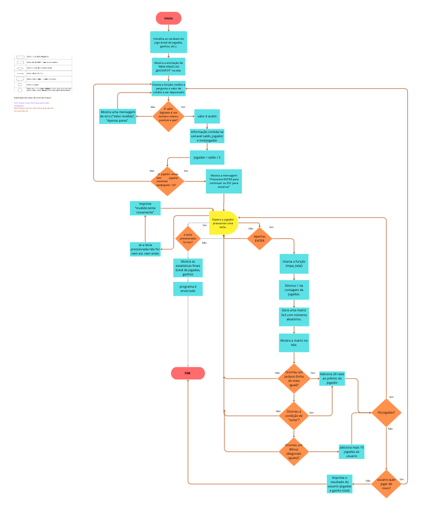

# JJJACKSPOT

  1. Introdução

Este projeto consiste em um jogo de máquina caça-níquel (slot machine) chamado "JJJACKSPOT", usando como referência a primeira letra dos participantes do projeto.
O projeto foi desenvolvido inteiramente em linguagem Python. O jogo é executado no terminal e oferece uma experiência interativa e divertida, simulando as mecânicas de uma máquina de cassino. O objetivo é proporcionar entretenimento e demonstrar a aplicação de diversas bibliotecas Python.

  2. Propósito

O principal propósito do JJJACKSPOT é servir como um projeto de entretenimento, além de um exercício prático de programação. Através dele, são explorados conceitos como manipulação de eventos de teclado, geração de números aleatórios, e formatação de saídas no console para criar uma interface de usuário amigável, mesmo em um ambiente de texto. O projeto também serve para consolidar o conhecimento dos autores em lógica de programação.
Funcionalidades
O script, desenvolvido em Python, simula uma máquina caça-níquel com as seguintes funcionalidades:
Sistema de Créditos: O jogador insere um valor monetário (em Reais), que é convertido em créditos para as jogadas. O sistema aceita apenas valores pares, onde cada R$ 2,00 equivale a 1 crédito.
Mecânica de Jogo: O jogador pressiona a tecla “ENTER” para "puxar a alavanca" e girar os números. A cada rodada, uma matriz 3x3 de números aleatórios é gerada e exibida.
Jackpot: Se os três números da linha do meio forem idênticos, o jogador ganha o "JACKPOT", acumulando um prêmio de R$ 20,00.
Rodadas Bônus: Se os números da diagonal principal ou da diagonal secundária forem idênticos, o jogador recebe um bônus de 10 rodadas grátis.
Controle de Jogo: O jogador pode encerrar a partida a qualquer momento pressionando a tecla ESC.
Relatório Final: Ao final da sessão, seja por falta de créditos ou por decisão do jogador, um resumo é exibido com o total de rodadas jogadas e o montante total ganho.

  3. Como Usar:

Para executar o jogo, siga estes passos:

  3.1 Pré-requisitos:
Certifique-se de ter o Python instalado em sua máquina.
Instale as bibliotecas necessárias através do pip no seu terminal:
pip install NumPy
pip install keyboard
pip install emoji
Observação: A biblioteca “msvcrt” é específica para Windows.

  3.2 Execute o script Python
Salve o código em um arquivo, por exemplo, “jjjackspot.py.”
Abra o terminal, navegue até a pasta onde salvou o arquivo e execute o código.
O jogo será iniciado diretamente no terminal. Siga as instruções na tela para adicionar créditos e começar a jogar.

  4. Créditos
Este projeto foi desenvolvido por Jailine Coelho Santos, Juliana Laura Silva Leite e Julio Da Cruz Neto.

  5. Fluxograma
     Clique <a href="https://www.canva.com/design/DAGxgHrPqQ0/10FuubGTS1DMIwDZ5LCM9w/edit?utm_content=DAGxgHrPqQ0&utm_campaign=designshare&utm_medium=link2&utm_source=sharebutton">aqui</a> para acessar o fluxograma para melhor visualização.

     
